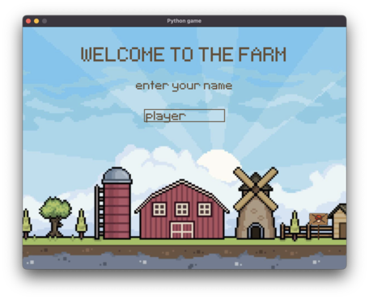

# 🍄 Mushrooms Foraging Game 🍄

## Disclaimer

The game is created only for educational purposes and is using copyrighted images, sounds and assets found on the internet.

## About

There are three types of mushrooms to collect in the game: normal (brown), poisonous (red), and healing (purple). The player needs to collect normal and healing mushrooms while avoiding the poisonous ones. The difficulty of the game increases as the player's score rises.

## Requirements

- [Python](https://www.python.org/)
- [Pygame](https://www.pygame.org/)

## Installation

1. Clone the repository or download ZIP

```
git clone git@github.com:jamber751/python-game.git
```

2. Run the game

```
cd python-game
python game.py
```

## Screenshots

<div align='center'>
	<table>
		<tr>
			<td></td>
			<td></td>
		</tr>
        <tr>
			<td></td>
			<td></td>
		</tr>
	</table>
</div>
```
